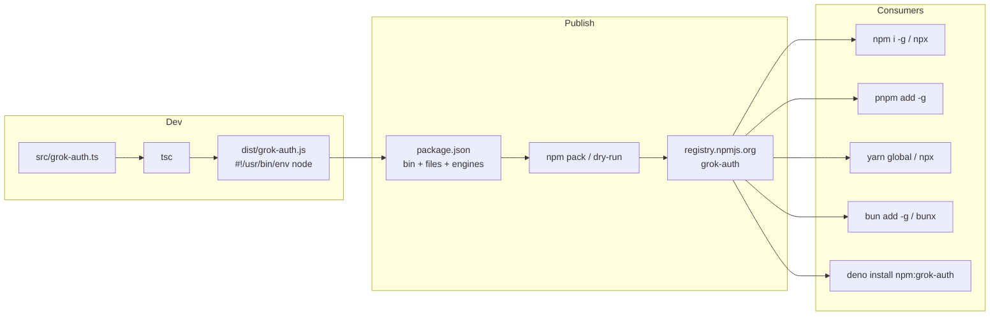

# feat: Publish Node-compatible grok-auth to npm

## Summary

Package **grok-auth** so plain Node users and any Node-compatible package manager (npm, pnpm, yarn, bun, Deno via `npm:`) can install and run it from the public npm registry. The CLI already uses only Node stdlib; the work is compile-to-JS packaging, manifest/docs, dry-run verification, then `npm publish` (user is already logged in as `taquangkhoi`).

## Problem Frame

Today the tool is Bun-oriented: shebang `#!/usr/bin/env bun`, `bin` points at `./grok-auth.ts`, `engines.bun` only, and TypeScript is not emitted. Node refuses TypeScript inside `node_modules`, so registry consumers cannot run the package. Install docs only describe clone + symlink.

## Requirements

- R1. Published package installs and runs under plain Node (no Bun required on PATH).
- R2. Global and one-shot install works via npm, pnpm, yarn, and bun; Deno can run via `npm:grok-auth` (with FS permissions for `~/.grok`).
- R3. `bin` entry `grok-auth` points at compiled ESM JavaScript with `#!/usr/bin/env node`.
- R4. Package tarball contains only intended artifacts (`dist`, README, LICENSE, package.json) — not `codedb.snapshot`, local tooling, or secrets.
- R5. `package.json` declares accurate Node engines, license, and GitHub repository metadata.
- R6. README documents registry install for the major managers and keeps the existing usage/commands docs.
- R7. First publish is dry-run verified (`npm pack` / `npm publish --dry-run`) then published publicly as unscoped `grok-auth@1.0.0` (name currently free).
- R8. Runtime behavior of the CLI is unchanged for existing commands; external `grok` CLI remains a documented runtime dependency for `add` / login flows, not an npm dependency.

## Key Technical Decisions

- KTD1. **Ship compiled ESM JS via `tsc`, not TypeScript source.** Node does not execute TS from `node_modules`. `tsc` alone is enough for a zero-runtime-dep single-file CLI; skip esbuild/tsup unless bundling becomes necessary later.
- KTD2. **Node-only shebang (`#!/usr/bin/env node`) on the published bin.** Dual/Bun shebangs break plain Node. Bun/Deno consumers still run the Node-compatible JS.
- KTD3. **Unscoped name `grok-auth`.** Name is free; shorter install UX. Scoped package would need `--access public` and a longer install name without a technical win for this single CLI.
- KTD4. **`files` allowlist (`["dist"]`) over `.npmignore`.** Explicit publish surface; README and LICENSE are always included by npm. Prevents leaking `codedb.snapshot` and other local files.
- KTD5. **Source layout: move CLI to `src/grok-auth.ts`, emit to `dist/grok-auth.js`.** Keeps root clean and makes `rootDir`/`outDir` unambiguous.
- KTD6. **`engines.node`: `>=18`.** Code uses only stable Node builtins + ESM; 18 is a safe floor. Remove `engines.bun` as a hard requirement (Bun remains optional for local dev if desired).
- KTD7. **`prepublishOnly` runs build.** Prevents publishing without a fresh `dist/`.
- KTD8. **Manual first publish from local machine.** User already ran `npm login` (`npm whoami` → `taquangkhoi`). Trusted Publishing / GitHub Actions is deferred.

## High-Level Technical Design



Published shape (authoritative):

```text
package/
  package.json          # bin → ./dist/grok-auth.js
  README.md
  LICENSE
  dist/
    grok-auth.js        # ESM, node shebang
```

## Scope Boundaries

### In scope

- TypeScript → Node ESM build
- Package metadata for public npm
- LICENSE + install docs for multi-manager consumers
- Dry-run verification and first public publish

### Out of scope

- New CLI features or auth-protocol changes
- Automated CI release / trusted publishers (follow-up)
- Dual CJS/ESM library `exports` (this is a bin-only CLI)
- Publishing private packages or alternate registries
- Rewriting for Deno-native APIs (npm-compat path only)

### Deferred to Follow-Up Work

- GitHub Actions trusted publishing + provenance
- Automated version bumps / changelog
- Automated test suite beyond smoke checks in this plan
- Capturing packaging learnings via `/ce-compound` after ship

## Implementation Units

### U1. Node ESM build pipeline

**Goal:** Compile the CLI to runnable Node JS with a correct shebang.

**Requirements:** R1, R3

**Dependencies:** None

**Files:**
- Create: `src/grok-auth.ts` (move from root `grok-auth.ts`)
- Modify: `tsconfig.json`
- Create: `dist/` via build (gitignored output preferred; publish from local/CI build)
- Modify: `.gitignore` (ensure `dist/` and `*.tgz` if desired)

**Approach:**
- Move source under `src/`; change shebang to `#!/usr/bin/env node` (tsc preserves shebang on emit).
- `tsconfig`: emit enabled, `outDir: "dist"`, `rootDir: "src"`, `module`/`moduleResolution`: `NodeNext`, replace `bun-types` with Node types, drop `noEmit: true`.
- Add devDependencies: `typescript`, `@types/node`.
- Add `build` script (`tsc`). Confirm no Bun-specific APIs remain (already true: only `fs`/`path`/`os`/`child_process`/`process`).

**Patterns to follow:** Zero-runtime-deps single-file CLI; pure Node builtins already in source.

**Test scenarios:**
- Happy path: after build, `node dist/grok-auth.js --help` prints help and exits 0 without Bun on PATH.
- Edge: first line of `dist/grok-auth.js` is `#!/usr/bin/env node`.
- Error path: build fails if TypeScript errors (typecheck remains strict).

**Verification:** Build succeeds; help runs under Node only.

---

### U2. Package manifest for registry consumers

**Goal:** Make `package.json` a correct public CLI package.

**Requirements:** R1, R2, R3, R4, R5, R7

**Dependencies:** U1

**Files:**
- Modify: `package.json`

**Approach:**
- `"bin": { "grok-auth": "./dist/grok-auth.js" }`
- `"files": ["dist"]`
- `"engines": { "node": ">=18" }` — remove hard `engines.bun`
- Scripts: `build` (`tsc`), `prepublishOnly` → `npm run build`; optional `typecheck` can reuse the same emit config or a separate noEmit pass if desired
- Metadata: `repository` / `homepage` / `bugs` → `https://github.com/KeiosStarqua/grok-auth`, keywords, keep MIT `license`
- No runtime `dependencies`; do not list `grok` as npm dep (PATH peer/runtime tool)
- Optional: omit `main`/`exports` unless library import is desired (bin-only is enough)

**Test scenarios:**
- Happy path: `npm pack --dry-run` lists `package.json`, `README.md`, `LICENSE` (once present), `dist/grok-auth.js` only among code.
- Edge: tarball does **not** include `codedb.snapshot`, `src/`, or `docs/`.
- Integration: `npm publish --dry-run` succeeds while authenticated.

**Verification:** Dry-run pack contents match the allowlist intent.

---

### U3. LICENSE and consumer install docs

**Goal:** Legal file + multi-manager install instructions.

**Requirements:** R2, R5, R6, R8

**Dependencies:** U2 (for final package name/commands)

**Files:**
- Create: `LICENSE` (MIT)
- Modify: `README.md`

**Approach:**
- Add standard MIT LICENSE matching package license field.
- Replace clone/symlink-only Install section with:
  - `npm i -g grok-auth` / `npx grok-auth`
  - `pnpm add -g grok-auth` / `pnpm dlx grok-auth`
  - yarn equivalent (document classic global or prefer npx/pnpm if Berry global is awkward)
  - `bun add -g grok-auth` / `bunx grok-auth`
  - Deno: `deno install -g -A npm:grok-auth` (or `deno run -A npm:grok-auth`) with note that FS access to `~/.grok` is required
- Document Node `>=18` requirement.
- Document runtime dependency: `grok` CLI on PATH for `add` / interactive login flows.
- Keep Quick start, Commands, How it works, security notes unchanged in substance.
- Optional one-liner: contributors may still run from source with Bun/Node after build.

**Test scenarios:**
- Happy path: README install commands match package name `grok-auth` and do not require Bun.
- Edge: security notes about profile tokens and `chmod 600` remain present.

**Verification:** README is accurate for registry consumers; LICENSE present at repo root.

---

### U4. Smoke install, first publish

**Goal:** Prove consumer install under Node, then publish `1.0.0` publicly.

**Requirements:** R1, R2, R4, R7

**Dependencies:** U1, U2, U3

**Files:**
- No code changes expected; may touch `package.json` version only if bump required

**Approach:**
1. `npm run build`
2. `npm pack --dry-run` and inspect file list
3. `npm publish --dry-run`
4. Local smoke: `npm pack` → `npm i -g ./grok-auth-1.0.0.tgz` → `grok-auth --help` / `grok-auth list` under Node-only environment
5. Optional second smoke with `pnpm` or `npx` against the tarball if convenient
6. Confirm `npm whoami` is the intended publisher account
7. `npm publish` (unscoped public default)
8. Post-check: `npm view grok-auth version` and `npx grok-auth --help`
9. Uninstall local tarball install if it shadows registry

**Execution note:** Prefer verifying tarball install before the irreversible first publish. Do not republish the same version if something is wrong — bump semver.

**Test scenarios:**
- Happy path: global bin runs after tarball install; registry install works after publish.
- Error path: if dry-run fails (auth, missing files, build), fix before real publish.
- Edge: confirm published version is immutable; never reuse `1.0.0` after a bad publish — ship `1.0.1`.

**Verification:** `npm view grok-auth` shows `1.0.0`; remote install runs help successfully.

## Risks & Dependencies

| Risk | Mitigation |
|------|------------|
| Accidental publish of secrets or local junk | `files: ["dist"]`; never commit auth dumps; verify with `npm pack --dry-run` |
| Missing LICENSE while claiming MIT | U3 adds LICENSE before publish |
| `npm whoami` is `taquangkhoi` (not GitHub `KeiosStarqua`) | Expected for npm; document in publish step; repository URL still points at GitHub |
| First publish is permanent for that version | Dry-run + tarball smoke first; patch version on fix |
| Users lack `grok` on PATH | Document clearly; only `add`/login path fails without it |
| Windows chmod / shebang | npm bin shims handle Windows; existing try/catch on chmod remains |

**Dependencies / prerequisites**

- npm login already completed (publisher: `taquangkhoi`)
- GitHub repo exists: `https://github.com/KeiosStarqua/grok-auth`
- Name `grok-auth` free on registry (verified 404 at plan time — re-check immediately before publish)

## System-Wide Impact

- **Consumers:** Install path shifts from git clone + symlink to registry install; local symlink workflow can remain for active development.
- **Security posture:** Unchanged at rest (profiles still local `chmod 600`); package itself carries no tokens.
- **Ops:** Manual publish for v1; CI automation deferred.

## Open Questions

None blocking. Deferred (non-blocking): whether to automate releases with trusted publishing later.

## Sources & Research

- Local: package is Bun-packaged today but uses only Node builtins (`fs`, `path`, `os`, `child_process`); no `Bun.*` APIs.
- External: npm CLI packaging rules (bin must be executable JS with node shebang); Node does not run TS from `node_modules`; prefer `files` allowlist + `prepublishOnly` build; unscoped public publish default.
- Institutional: no repo-local packaging learnings; adjacent CE notes favor local-first dev after publish and not hand-editing versions once automation exists (automation out of scope here).
